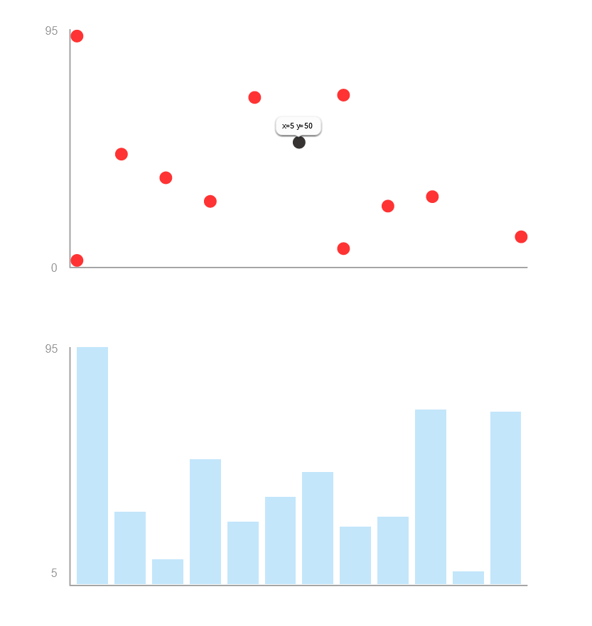

# Simple-Charts.js

`simple-charts.js` is a small library for creating charts in an object-oriented manner.

## Usage

```html
<body>
    <div id="chart1"></div>
    <div id="chart2"></div>
</body>
```

```javascript
let g4 = new DottedChart(500,900,'chart1','te',[95,0,10,50,25,35,45,23,27,70,5,69],[0,0,10,5,3,2,1,7,8,6,6,4])
g4.setDotColor('red')
g4.setDotOpacity(0.8)
g4.setDotHoverBrightness(2)
g4.render()
let g1 = new BarChart(500,900,'chart2','se',[95,29,10,50,25,35,45,23,27,70,5,69],[5,10,15,5,3,40,25,7,10,6,7,4]) 
g1.render()
```

